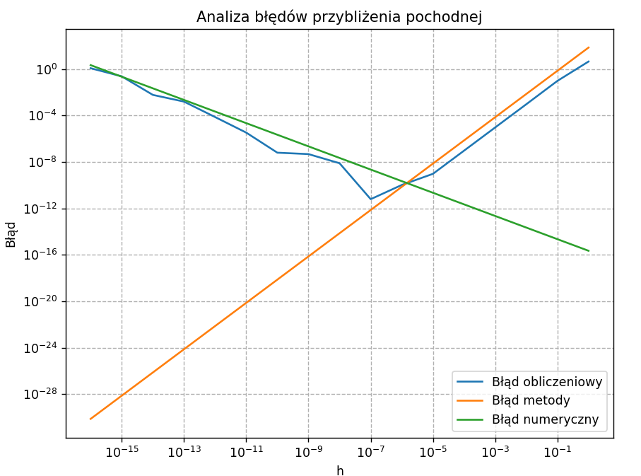
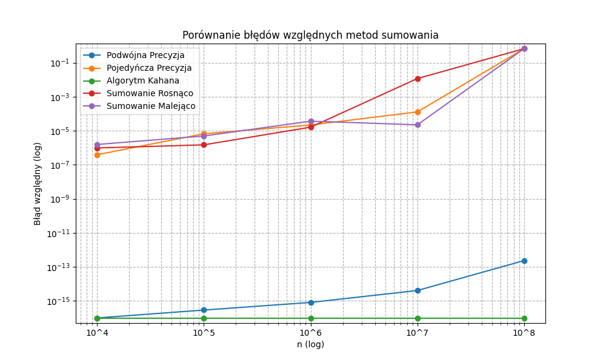

# Sprawozdanie z Laboratorium 01

## Autor: Mateusz Pawliczek, Piotr Świerzy
## Data: 11.03.25

---

## Zadanie 1 : Błąd przybliżeń pochodnej funkcji

#### Treść zadania:

Celem zadania było obliczenie przybliżonej wartości pochodnej funkcji, używając wzoru na różnicę prawostronną oraz różnicę centralną. Dla funkcji f(x) = tan(x), przy x = 1, wyznaczone zostały wartości błędów numerycznych, obliczeniowych oraz truncation error w zależności od wartości h. Dodatkowo, porównano wyznaczoną wartość h_min z wartością obliczoną za pomocą wzoru.

#### Argumentacja oraz fragment algorytmu:

1. **Obliczenie wartości pochodnej dla funkcji tangens**:
   Przy pomocy wzoru na różnicę prawostronną przybliżono pochodną funkcji f(x) = tan(x).

   Wzór na różnicę prawostronną to:
   ```math
   f'(x) ≈ \frac{f(x+h) - f(x)}{h}
   ```

   Wartość błędu obliczeniowego została obliczona jako różnica między otrzymaną wartością a wartością rzeczywistą pochodnej, która jest opisana wzorem:
   ```math
   f'(x) = 1 + \tan^2(x)
   ```

   Błąd truncation (błąd przybliżenia) został obliczony przy użyciu drugiej pochodnej funkcji, natomiast błąd numeryczny (zaokrąglenia) został obliczony przy użyciu wartości \( \epsilon \), która reprezentuje najmniejszą możliwą wartość w typie float64.

2. **Wzory użyte w zadaniu**:
   - Wzór na różnicę prawostronną:
     ```math
     f'(x) ≈ \frac{f(x+h) - f(x)}{h}
     ```
   - Błąd truncation:
     ```math
     TE(h) = \frac{M \cdot h}{2}
     ```
   - Błąd numeryczny:
     ```math
     NE(h) = \frac{2 \cdot \epsilon}{h}
     ```
   - Minimalna wartość \( h \) wyznaczona ze wzoru:
     ```math
     h_{\text{min}} = 2 \sqrt{\frac{\epsilon}{M}}
     ```

3. **Druga metoda - różnica centralna**:
   Różnica centralna jest bardziej dokładna od różnicy prawostronnej, ponieważ wykorzystuje wartości funkcji w obu kierunkach (w lewo i w prawo od punktu \( x \)).

   Wzór na różnicę centralną to:
   ```math
   f'(x) ≈ \frac{f(x+h) - f(x-h)}{2h}
   ```

   Wartość błędu obliczeniowego została obliczona w podobny sposób jak w przypadku różnicy prawostronnej, z tą różnicą, że dla tej metody błąd truncation obliczono przy użyciu trzeciej pochodnej funkcji.

   Błąd truncation dla tej metody:
   ```math
   TE(h) = \frac{M \cdot h^2}{6}
   ```

   Minimalna wartość \( h \) dla tej metody została wyznaczona ze wzoru:
   ```math
   h_{\text{min}} = 3 \sqrt[3]{\frac{3 \epsilon}{M}}
   ```

#### Wykresy oraz wyniki:

Na wykresie przedstawione są wartości błędu obliczeniowego, błędu metody oraz błędu numerycznego dla różnych wartości 

```math
h = 10^{-k}, k = 0,...,16
```

Użyta została skala logarytmiczna na obu osiach.

**Wykresy dla zadania 1:**

**Analiza błędów przy użyciu różnicy prawostronnej:**

```python
import numpy as np
import matplotlib.pyplot as plt

def f(x):
  return np.tan(x)

def df(x):
  return 1 + np.tan(x)**2

def df2(x):
  return 2*np.tan(x) * df(x)

def df_approx(x , h):
  return (f(x+h) - f(x)) / h

def epsilon(): #error for float64
  return 2.220446 * (10.0 ** -16)

x0 = 1
true_df = df(x0)
h_values = 10.0 ** -np.arange(0,17)
M = df2(x0)

def truncation_error(h):
  global M
  return M * h / 2.0

def rounding_error(h):
  return 2.0 * epsilon() / h

def computational_error(h):
  global x0
  return np.abs(df_approx(x0 , h) - df(x0))

h_min = 2 * np.sqrt(epsilon() / M)
print("h_min: ", h_min)
print("h_min abs error: ", np.abs(computational_error(h_min) / df(1)))
```

**Analiza błędów przy użyciu różnicy centralnej:**

```python
import numpy as np
import matplotlib.pyplot as plt

def f(x):
  return np.tan(x)

def df(x):
  return 1 + np.tan(x)**2

def df2(x):
  return 2*np.tan(x) * df(x)

def df3(x):
  return 4.0 * df2(x)**2 - 2.0 * df2(x)

def df_approx(x , h):
  return (f(x+h) - f(x-h)) / (2.0*h)

def epsilon(): #error for float64
  return 2.220446 * (10.0 ** -16)

x0 = 1
true_df = df(x0)
h_values = 10.0 ** -np.arange(0,17)
M = df3(x0)

def truncation_error(h):
  global M
  return M * h**2.0 / 6.0

def rounding_error(h):
  return epsilon() / h

def computational_error(h):
  global x0
  return np.abs(df_approx(x0 , h) - df(x0))

h_min = 2 * np.pow(3.0 * epsilon() / M , 1.0/3.0)
print("h_min: ", h_min)
print("h_min abs error: ", np.abs(computational_error(h_min) / df(1)))
```

Program na koniec wyświetla wyniki w postaci wykresów korzystając z następującego kodu:

```python
plt.figure(figsize=(8, 6))
plt.loglog(h_values, computational_error(h_values), label='Błąd obliczeniowy')
plt.loglog(h_values, truncation_error(h_values), label='Błąd metody')
plt.loglog(h_values, rounding_error(h_values), label='Błąd numeryczny')
plt.xlabel('h')
plt.ylabel('Błąd')
plt.legend()
plt.title('Analiza błędów przybliżenia pochodnej (różnica prawostronna)')
plt.grid(True, which='both', linestyle='--')
plt.show()
```

**Wykresy przedstawiające błędy obliczeniowe, metody oraz numeryczne dla różnych wartości h:**

- **Wykres dla różnicy prawostronnej:**


- **Wykres dla różnicy centralnej:**



Wyznaczone zostały również najmniejsze wartości h_min zgodnie ze wzorem:
```math
h_{min} = |\frac{E(h_{min})}{f'(x)}|
```

Otrzymane wyniki h_min:

```
różnica prawostronna:
h_min = 9.1236 * 10^{-9}
error = 1.6428 * 10^{-8}
różnica centralna:
h_min = 2.3069 * 10^{-6}
error = 1.1952 * 10^{-11}
```

#### Wnioski:

1. **Analiza błędów obliczeniowych:**
   - Wartość h_min dla metody różnicy prawostronnej, przy której błąd obliczeniowy osiąga minimum, jest zgodna z teorią i wyznaczoną wartością ze wzoru:
   ```math
   h_{\text{min}} \approx 2 \sqrt{\frac{\epsilon}{M}}
   ```
   - Dla metody różnicy centralnej, wartość h_min również wykazuje zgodność z teorią, a wzór 
   ```math
   h_{\text{min}} \approx 3 \sqrt[3]{\frac{3 \epsilon}{M}}
   ```
   daje bardzo dokładne wyniki.
   - Obie metody pokazują, że dla wartości h mniejszych od h_min, błąd obliczeniowy zaczyna rosnąć z powodu błędu numerycznego.

2. **Porównanie metod:**
   - Metoda różnicy centralnej daje lepsze wyniki, szczególnie dla mniejszych wartości h, ponieważ jest dokładniejsza niż różnica prawostronna. 

Oczywiście, poniżej znajdziesz sprawozdanie tylko dla **Zadania 2**:

---

## Zadanie 2

#### Treść zadania:

Celem zadania było porównanie różnych metod sumowania liczb zmiennoprzecinkowych o pojedynczej i podwójnej precyzji, w tym algorytmu Kahana, metody sumowania liczb rosnących oraz malejących, w kontekście błędów numerycznych. Zadanie polegało na generowaniu losowych liczb zmiennoprzecinkowych, a następnie obliczeniu ich sumy z wykorzystaniem różnych metod. Dla każdej metody obliczono względny błąd względem wartości dokładnej.

#### Argumentacja oraz fragment algorytmu:

1. **Metody sumowania:**
   - **Metoda a**: Suma z wykorzystaniem podwójnej precyzji (`sum_double_precision`). Każda liczba jest traktowana jako typ `float64` podczas obliczeń, co zapewnia większą dokładność.
   - **Metoda b**: Suma z wykorzystaniem pojedynczej precyzji (`sum_single_precision`). Liczby traktowane są jako `float32`, co może prowadzić do większych błędów numerycznych w porównaniu do metody a.
   - **Metoda c**: Suma z wykorzystaniem algorytmu Kahana (`sum_kahan_alg`). Algorytm ten minimalizuje błędy zaokrągleń, starając się poprawić precyzję sumy.
   - **Metoda d**: Suma liczb po ich posortowaniu w porządku rosnącym (`sum_rising`). Przy tej metodzie suma jest obliczana po posortowaniu liczb w porządku rosnącym.
   - **Metoda e**: Suma liczb po ich posortowaniu w porządku malejącym (`sum_falling`). Liczby są posortowane w porządku malejącym, co może prowadzić do większych błędów numerycznych.

2. **Obliczenia i porównanie:**
   Dla każdej z metod obliczono względny błąd numeryczny w odniesieniu do sumy obliczonej za pomocą dokładnej metody `fsum` z biblioteki `math`. Względny błąd dla każdej metody został obliczony jako:
   ```math
   \text{względny błąd} = \frac{|suma_{\text{obliczona}} - suma_{\text{dokładna}}|}{|suma_{\text{dokładna}}|}
   ```

   Zmieniając rozmiar próbki n od 10^4 do 10^8, porównano błędy dla różnych metod sumowania. Dodatkowo, aby uniknąć wartości zerowych w obliczeniach, dodano funkcję `safe_sum`, która zapewnia, że wynik nie przekroczy wartości minimalnej precyzji.

#### Kod Python:

```python
import numpy as np
import matplotlib.pyplot as plt
import math

def generate_numbers(n):
    return np.random.uniform(0, 1, n).astype(np.float32)

def true_sum_value(numbers):
    return math.fsum(numbers)

def sum_double_precision(numbers):
    acc = np.float64(0.0)
    for num in numbers:
        acc += np.float64(num)
    return acc

def sum_single_precision(numbers):
    acc = np.float32(0.0)
    for num in numbers:
        acc += np.float32(num)
    return acc

def sum_kahan_alg(numbers):
    acc = np.float32(0.0)
    err = np.float32(0.0)
    for num in numbers:
        y = num - err
        temp = acc + y
        err = (temp - acc) - y
        acc = temp
    return acc

def sum_rising(numbers):
    return sum_single_precision(np.sort(numbers))

def sum_falling(numbers):
    return sum_single_precision(np.flip(np.sort(numbers)))

def safe_sum(value, epsilon=1e-20):
    return value if abs(value) > epsilon else epsilon

n_array = np.array([10 ** k for k in range(4, 9)])
max_n = n_array[-1]

numbers = generate_numbers(max_n)

methods = ['a', 'b', 'c', 'd', 'e']
errors = {method: [] for method in methods}

for n in n_array:
    subset = numbers[:n]
    true_sum = true_sum_value(subset)
    errors['a'].append(safe_sum(abs(sum_double_precision(subset) - true_sum) / true_sum))
    errors['b'].append(safe_sum(abs(sum_single_precision(subset) - true_sum) / true_sum))
    kahan_error = safe_sum(abs(sum_kahan_alg(subset) - true_sum) / true_sum)
    errors['c'].append(kahan_error if kahan_error > 0 else 1e-20)
    errors['d'].append(safe_sum(abs(sum_rising(subset) - true_sum) / true_sum))
    errors['e'].append(safe_sum(abs(sum_falling(subset) - true_sum) / true_sum))

plt.figure(figsize=(10, 6))
for method in methods:
    plt.loglog(n_array, errors[method], 'o-', label=f'Metoda {method}')
plt.xlabel('n (log)')
plt.ylabel('Błąd względny (log)')
plt.title('Porównanie błędów względnych metod sumowania')
plt.legend()
plt.grid(True, which='both', linestyle='--')
plt.xticks(n_array, [f'10^{k}' for k in range(4, 9)])

all_values = np.concatenate([errors[method] for method in methods])
ymin, ymax = np.min(all_values), np.max(all_values)
plt.ylim(ymin * 0.5, ymax * 2)

plt.show()
```

#### Wyniki:

Na wykresie przedstawiono porównanie błędów względnych różnych metod sumowania w zależności od rozmiaru próbki n. Użyta została skala logarytmiczna na obu osiach.



#### Wnioski:

1. **Analiza wyników:**
  Metody **b, d, e** posiadają bardzo przybliżone względem siebie wartości błędów. Metoda c posiada bardzo dużą dokładność obliczeń, która przy obranym systemie liczbowym (float32) zwraca wynik 0.0. Biorąc pod uwagę, że w skali logarytmicznej nie może istnieć wartość 0 dla wyników **c** obrano wartość 10^(-16). Metoda **a** okazała się drugą najbardziej dokładną metodą sumowania.

2. **Wnioski praktyczne:**
   - Dla małej próbki liczb zmiennoprzecinkowch można zastosować metodę a, która zapewnia dużą dokładność.
   - **Algorytm Kahana** jest dobrym rozwiązaniem szczególnie gdy operujemy na pojedyńczej precyzji (float32) wtedy błąd wychodzi bardzo bliski zeru (bez metody safe_sum program zwraca równo 0.0).
   - Metoda pojedynczej precyzji oraz sumowanie zarówno w porządku malejącym jak i rosnącym wykazało dużo mniejszą precyzję w porównaniu do pozostałych metod.

## Zadanie 3: Unikanie zjawiska kancelacji

Unikanie kancelacji ma na celu usunięcie ryzyka utraty danych wynikających z zaokrągleń danych operacji matematycznych np. odejmowania które jest operacją podatną na utratę danych.

### Podpunkt A

Aby uniknąć zjawiska kancelacji, możemy pomnożyć przez sprzężenie:
```math
\sqrt{x+1} - 1 = \frac{(\sqrt{x+1} - 1)(\sqrt{x+1} + 1)}{\sqrt{x+1} + 1} = \frac{x}{\sqrt{x+1} + 1}
```
W ten sposób otrzymujemy równanie, które zamiast korzystania z operacji odejmowania używa dzielenia, które jest stabliniejsze.
### Podpunkt B

Rozkładamy na iloczyn:
```math
x^2 - y^2 = (x - y)(x + y)
```
Zamiast odejmowania dużych liczb, operujemy na ich różnicy. W ten sposób dla bardzo bliskich sobie liczb x ~ y wykorzystujemy iloczyn z pojedyńczą operacją odejmowania.

### Podpunkt C

Mnożymy przez sprzężenie:
```math
1 - \cos x = \frac{(1 - \cos x)(1 + \cos x)}{1 + \cos x} = \frac{\sin^2 x}{1 + \cos x}
```
Dzięki temu unikamy bezpośredniego odejmowania wartości bliskich sobie, co mogłoby prowadzić do utraty precyzji.

### Podpunkt D

Korzystamy z tożsamości trygonometrycznej:
```math
\cos^2 x - \sin^2 x = \cos 2x
```
Użycie pojedyńczej funkcji trygonometrycznej jest dokładniejsze niż korzystając z różnicy cos^2(x) - sin^2(x).

### Podpunkt E

Przekształcamy:
```math
\ln x - 1 = \ln \frac{x}{e}
```
Dla podpunktu E, możemy przybliżyć wartość lx(x) - 1 zamieniając 1 w ln(e) i sprowadzając do pojedyńczego logarytmu. W ten sposób unikamy odejmowania które jest dużo mniej stabline niż dzielenie.

### Podpunkt F

Rozwijamy w szereg Taylora:
```math
e^x - e^{-x} = 2x + \frac{2x^3}{3!} + \mathcal{O}(x^5)
```
Dla małych \( x \) najlepszym przybliżeniem jest:
```math
e^x - e^{-x} \approx 2x + \frac{2x^3}{3!}
```
To rozwinięcie pozwala uniknąć odejmowania niemal równych liczb  i , co mogłoby prowadzić do znacznej utraty precyzji w pobliżu zera.

## Zadanie 4: Analiza niepewności sprawności kolektorów

Efektywność \( \eta \) kolektora słonecznego dana jest wzorem:

```math
\eta = K \frac{Q T_d}{I}
```

Zmienna \( K \) jest stałą, więc jej błąd nie wpływa na niepewność względną \( \eta \). Błąd względny \( \eta \) obliczamy jako:

```math
\Delta \eta = |\Delta Q| + |\Delta T_d| + |\Delta I|
```

### Obliczenia dla kolektora S1:

```math
\Delta \eta_{S1} = |1.5\%| + |1.0\%| + |3.6\%| = 6.1\%
```

```math
\eta_{S1} = 0.76 \pm (0.76 \times 0.061) = 0.76 \pm 0.046
```

Zakres możliwych wartości:

```math
0.76 - 0.046 = 0.714
```
```math
0.76 + 0.046 = 0.806
```

### Obliczenia dla kolektora S2:

```math
\Delta \eta_{S2} = |0.5\%| + |1.0\%| + |2.0\%| = 3.5\%
```

```math
\eta_{S2} = 0.70 \pm (0.70 \times 0.035) = 0.70 \pm 0.025
```

Zakres możliwych wartości:

```math
0.70 - 0.025 = 0.675
```
```math
0.70 + 0.025 = 0.725
```

### Czy S1 ma większą sprawność niż S2?

Zakresy sprawności to:

```math
S1: (0.714 - 0.806)
```
```math
S2: (0.675 - 0.725)
```

Zakresy **nadal się nakładają** (0.714 – 0.725), więc **wciąż nie możemy jednoznacznie stwierdzić, że S1 jest bardziej efektywny niż S2**. Możemy jednak z dużym prawdopodobieństwem stwierdzić, że sprawność S1 jest większa niż S2.

#### Bibliografia:

- Dostępne meteriały wykładowe z przedmiotu MOWNiT
- "Numerical Methods for Engineers" – Steven C. Chapra, Raymond P. Canale.
- Dokumentacja biblioteki NumPy: https://numpy.org/doc/stable/